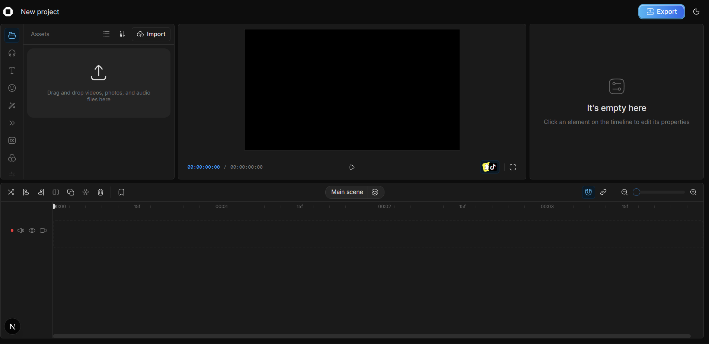

\*\*Project for the internship


## Why?

- **Privacy**: Your videos stay on your device
- **Free features**: Most basic CapCut features are now paywalled
- **Simple**: People want editors that are easy to use - CapCut proved that

## Features

- Timeline-based editing
- Multi-track support
- Real-time preview
- No watermarks or subscriptions
- Analytics provided by [Databuddy](https://www.databuddy.cc?utm_source=opencut), 100% Anonymized & Non-invasive.
- Blog powered by [Marble](https://marblecms.com?utm_source=opencut), Headless CMS.

## Project Structure

- `apps/web/` – Main Next.js web application
- `src/components/` – UI and editor components
- `src/hooks/` – Custom React hooks
- `src/lib/` – Utility and API logic
- `src/stores/` – State management (Zustand, etc.)
- `src/types/` – TypeScript types

## Getting Started

### Prerequisites

- [Bun](https://bun.sh/docs/installation)
- [Docker](https://docs.docker.com/get-docker/) and [Docker Compose](https://docs.docker.com/compose/install/)

> **Note:** Docker is optional but recommended for running the local database and Redis. If you only want to work on frontend features, you can skip it.

### Setup

1. Fork and clone the repository

2. Copy the environment file:

   ```bash
   # Unix/Linux/Mac
   cp apps/web/.env.example apps/web/.env.local

   # Windows PowerShell
   Copy-Item apps/web/.env.example apps/web/.env.local
   ```

3. Start MongoDB and Redis:

   ```bash
   docker compose up -d mongo redis serverless-redis-http
   ```

4. Install dependencies and start the dev server:

   ```bash
   bun install
   bun dev:web
   ```

The application will be available at [http://localhost:3000](http://localhost:3000).

The `.env.example` has sensible defaults that match the Docker Compose config — it should work out of the box.

### Self-Hosting with Docker

To run everything (including a production build of the app) in Docker:

```bash
docker compose up -d
```

The app will be available at [http://localhost:3100](http://localhost:3100).

## Contributing

We welcome contributions! While we're actively developing and refactoring certain areas, there are plenty of opportunities to contribute effectively.

**🎯 Focus areas:** Timeline functionality, project management, performance, bug fixes, and UI improvements outside the preview panel.

**⚠️ Avoid for now:** Preview panel enhancements (fonts, stickers, effects) and export functionality - we're refactoring these with a new binary rendering approach.

See our [Contributing Guide](.github/CONTRIBUTING.md) for detailed setup instructions, development guidelines, and complete focus area guidance.

**Quick start for contributors:**

- Fork the repo and clone locally
- Follow the setup instructions in CONTRIBUTING.md
- Create a feature branch and submit a PR

## License

[MIT LICENSE](LICENSE)

---


